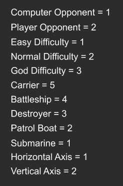
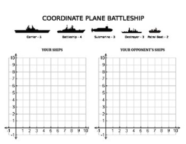
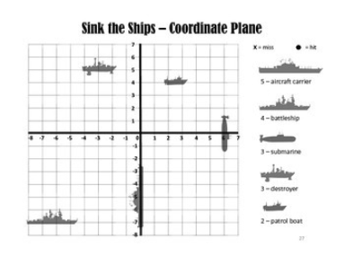
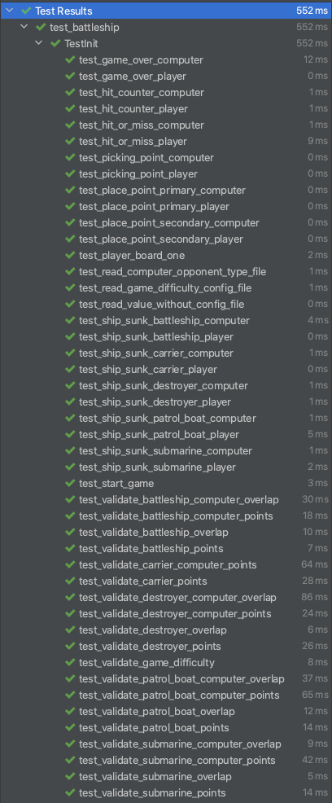

# BattleShip

I programmed the game Battleship. Battleship is a strategy type guessing game for two players. Each player has a board on which each player's fleet of ships are marked. The locations of the fleets are concealed from the other player. Players alternate turns calling "shots" at the other player's ships, and the objective of the game is to destroy the opposing player's fleet.

# Motivation

I made this project to learn the basics of Python. I am a Mechanical Engineer undergraduate who has found a passion for Computer Science. I programmed the game Battleship in my MATLAB class last semester and converted the syntax to Python syntax and had a working game in Python. Now, with the help of my uncle I am learning OOP. 

# How to install
Clone the git repository:`git clone git@github.com:skelkelian/python_battleship.git`

Change directory: `cd Battleship`

Run: `play_game`

# Legend Visual


This legend includes the values for the constants 

# Primary and Secondary Board Visual
 

These images are visuals for the primary and secondary board 


# Template config file for values
```
[main]
opponent_type = 1
game_difficulty = 1
carrier_player = 1, 2, 1
battleship_player = 2, 7, 1
destroyer_player = 1, 1, 8
patrol_boat_player = 2, 5, 6
submarine_player = 1, 9, 7
carrier_computer = 1, 1, 1
battleship_computer = 1, 2, 1
destroyer_computer = 1, 3, 1
patrol_boat_computer = 1, 4, 1
submarine_computer = 1, 5, 1
```

The first value for the ships determines whether it is horizontal or vertical. The second value for the ships is the row. The third value for the ships is the column.

# How to modify the config file
If you would like to change the locations for the ships, you must modify the config file. If you want to modify the position of the ship, you must change the row and column. You can select anything from 1-10, as long as none of the ships overlap one another. If you want to modify whether it is horizontal or vertical, change the first row. You can select either 1 for horizontal or 2 for vertical.

# How to test
**How to run a single test**

Go to `test_battleship.py`, right click the test you want to run and click run. 

**How to run all tests**

Go to `test_battleship.py`, right click outside any of the tests and click run.




This is what it looks like when all tests pass.
